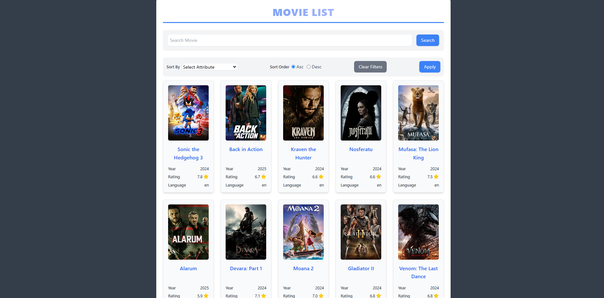

<h1>Desenvolvimento de uma aplicação para gerenciamento de filmes e séries de TV</h1>
<h2>Consumindo a api the_movie_db</h2>
<a href="https://developer.themoviedb.org/reference/intro/getting-started">Link da API</a>
<h2>Principais telas:</h2>
<h3>Listagem de Filmes</h3>

<h3>Listagem de Séries</h3>

<h3>Detalhe de Filme</h3>

<h3>Detalhe de Séries</h3>

